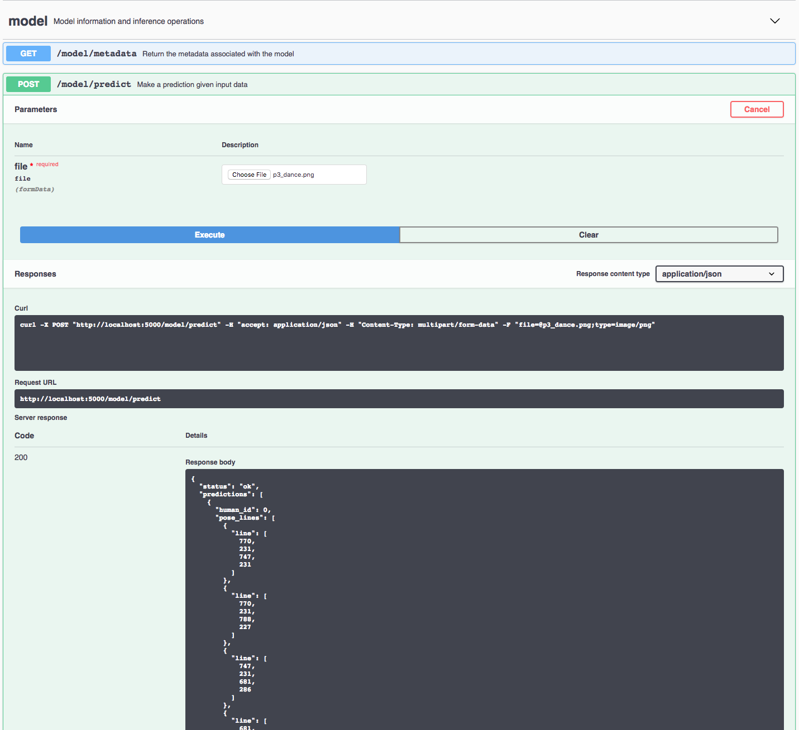

# IBM Developer Model Asset Exchange: Human Pose Estimator

The Human Pose Estimator model detects humans and their poses in a given image. The model first detects the humans in 
the input image and then identifies the body parts, including nose, neck, eyes, shoulders, elbows, wrists, hips, knees, 
and ankles. Next, each pair of associated body parts is connected by a "pose line"; for example, as the following image 
shows, a line may connect the left eye to the nose, while another may connect the nose to the neck.


Each pose line is represented by a list [x1, y1, x2, y2], where the first pair of coordinates (x1, y1) is the start 
point of the line for one body part, while the second pair of coordinates (x2, y2) is the end point of the line for the 
other associated body part. The pose lines are assembled into full body poses for each of the humans detected in the 
image.

The model is based on the TF implementation of [OpenPose model](https://github.com/ildoonet/tf-pose-estimation).
The code in this repository deploys the model as a web service in a Docker container. This repository was developed
as part of the [IBM Developer Model Asset Exchange](https://developer.ibm.com/exchanges/models/).

## Model Metadata
| Domain | Application | Industry  | Framework | Training Data | Input Data Format |
| ------------- | --------  | -------- | --------- | --------- | -------------- | 
| Vision | Pose Estimation | General | TensorFlow | [COCO](http://cocodataset.org/#home) | Image(RGB) | 

## References

* _Zhe Cao, Tomas Simon, Shih-En Wei, Yaser Sheikh,_ ["Realtime Multi-Person 2D Pose Estimation using Part Affinity Fields"](https://arxiv.org/abs/1611.08050), CVPR 2017.
* [TF-Pose-Estimation Github Repository](https://github.com/ildoonet/tf-pose-estimation)

## Licenses

| Component | License | Link  |
| ------------- | --------  | -------- |
| This repository | [Apache 2.0](https://www.apache.org/licenses/LICENSE-2.0) | [LICENSE](LICENSE) |
| Model Weights | [Apache 2.0](https://www.apache.org/licenses/LICENSE-2.0) | [LICENSE](https://github.com/ildoonet/tf-pose-estimation/blob/master/LICENSE) |
| Model Code (3rd party) | [Apache 2.0](https://www.apache.org/licenses/LICENSE-2.0) | [LICENSE](https://github.com/ildoonet/tf-pose-estimation/blob/master/LICENSE) |
| Test assets | Various | [Asset README](assets/README.md) |

## Pre-requisites:

* `docker`: The [Docker](https://www.docker.com/) command-line interface. Follow the [installation instructions](https://docs.docker.com/install/) for your system.
* The minimum recommended resources for this model is 2GB Memory and 1 CPU.

# Steps

1. [Deploy from Docker Hub](#deploy-from-docker-hub)
2. [Deploy on Kubernetes](#deploy-on-kubernetes)
3. [Run Locally](#run-locally)

## Deploy from Docker Hub

To run the docker image, which automatically starts the model serving API, run:

```
$ docker run -it -p 5000:5000 codait/max-human-pose-estimator
```

This will pull a pre-built image from Docker Hub (or use an existing image if already cached locally) and run it.
If you'd rather checkout and build the model locally you can follow the [run locally](#run-locally) steps below.

## Deploy on Kubernetes

You can also deploy the model on Kubernetes using the latest docker image on Docker Hub.

On your Kubernetes cluster, run the following commands:

```
$ kubectl apply -f https://github.ibm.com/CODAIT/MAX-Human-Pose-Estimator/raw/master/max-human-pose-estimator.yaml
```

The model will be available internally at port `5000`, but can also be accessed externally through the `NodePort`.

## Run Locally

1. [Build the Model](#1-build-the-model)
2. [Deploy the Model](#2-deploy-the-model)
3. [Use the Model](#3-use-the-model)
4. [Run the Notebook](#4-run-the-notebook)
5. [Development](#5-development)
6. [Cleanup](#6-cleanup)


### 1. Build the Model

Clone this repository locally. In a terminal, run the following command:

```
$ git clone https://github.ibm.com/ibm/MAX-Human-Pose-Estimator.git
```

Change directory into the repository base folder:

```
$ cd MAX-Human-Pose-Estimator
```

To build the docker image locally, run: 

```
$ docker build -t max-human-pose-estimator .
```

All required model assets will be downloaded during the build process. _Note_ that currently this docker image is CPU only (we will add support for GPU images later).


### 2. Deploy the Model

To run the docker image, which automatically starts the model serving API, run:

```
$ docker run -it -p 5000:5000 max-human-pose-estimator
```

### 3. Use the Model

The API server automatically generates an interactive Swagger documentation page. Go to `http://localhost:5000` to load it. From there you can explore the API and also create test requests.
Use the `model/predict` endpoint to load a test image (you can use one of the test images from the `assets` folder) and get predicted labels for the image from the API.



You can also test it on the command line, for example:

```
$ curl -F "file=@assets/test_image.jpg" -XPOST http://localhost:5000/model/predict
```

You should see a JSON response like that below:

```
{
  "status": "ok",
  "predictions": [
    {
      "human_id": 0,
      "pose_lines": [
        {
          "line": [
            444,
            269,
            392,
            269
          ]
        },
        
        ...
        
        {
          "line": [
            439,
            195,
            464,
            197
          ]
        }
      ],
      "body_parts": [
        {
          "part_id": 0,
          "part_name": "Nose",
          "score": "0.83899",
          "x": 428,
          "y": 205
        },
        
        ...
        
        {
          "part_id": 17,
          "part_name": "LEar",
          "score": "0.81776",
          "x": 464,
          "y": 197
        }
      ]
    },
    
    ...

  ]
}
```

### 4. Run the Notebook

Once the model server is running, you can see how to use it by walking through [the demo notebook](demo.ipynb). _Note_ the demo requires `jupyter`, `numpy`, `matplotlib`, `cv2`, `json`, and `requests`.

Run the following command from the model repo base folder, in a new terminal window (leaving the model server running in the other terminal window):

```
$ jupyter notebook
```

This will start the notebook server. You can open the simple demo notebook by clicking on `demo.ipynb`.

### 5. Development

To run the Flask API app in debug mode, edit `config.py` to set `DEBUG = True` under the application settings. You will then need to rebuild the docker image (see [step 1](#1-build-the-model)).

### 6. Cleanup

To stop the Docker container, type `CTRL` + `C` in your terminal.
